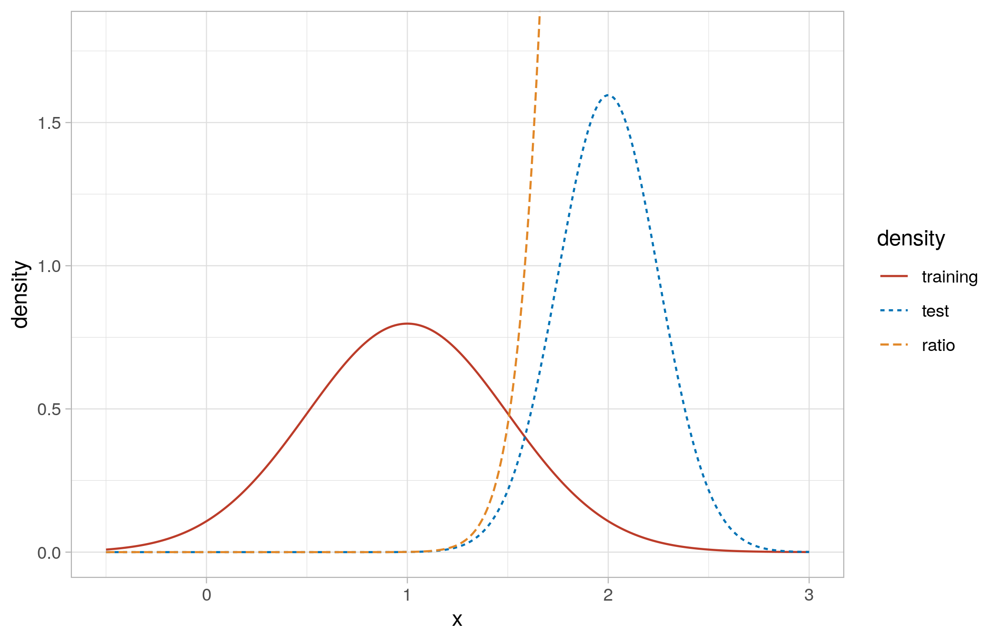

# Reproducing Sugiyama 2007

This is a basic exercise in covariate shift importance weighting. The 
simulation exercise described by Sugiyama *et al.* (2007) and some solutions 
using weighted least squares as well as uLSIF are implemented here.

# Derivation of Importance Weighting

When performing maximum likelihood estimation, the goal is to maximize the 
expected value of a likelihood function $L(X,Y)$ over the joint distribution of 
feature-target pairs $P(Y,X)$. This is estimated as the sample average 
$\frac{1}{N} \sum_{i=1}^{N} L(X_i,Y_i)$.

Now consider a distribution of feature-target pairs in a source domain with a 
probability density function $P_{S}(X,Y)$ and a target domain with a 
probability density function $P_{T}(X,Y)$. One may have labelled 
feature-target pairs from the source distribution but not from the target 
distribution. 

How could one train a model that maximizes the expected value of 
the likelihood $L(X,Y)$ over the target joint distribution? One could assume 
that $P_{S}(X,Y) = P(Y|X) P_{S}(X)$ and $P_{T}(X,Y) = P(Y|X) P_{T}(X)$, which 
means that the conditional distribution $P(Y|X)$ does not change between the 
two domains, and therefore only the distribution of the covariates changes. 
This is known as the covariate shift assumption. Assuming this, one could 
estimate the expected value of the likehood function as 
$\frac{1}{N} \sum_{i=1}^{N} \frac{P_{T}(X)}{P_{S}(X)} L(X_i,Y_i)$. However, 
this would require the densities of the unknown covariate distributions in 
the source and target domains.

Consider further a new combined distribution resulting from the mixture of 
both domains, with probability density function 
$P_{C}(X) = \gamma_{S} P_{S}(X) + \gamma_{T} P_{T}(X)$, where $\gamma_{S}$ and 
$\gamma_{T}$ are weights assigned to each domain in the mixture. This could be rewritten as 

$$
P_{C}(X) = P_{C}(S) P_{C}(X|S) + P_{C}(T) P_{C}(X|T),
$$

where $P_{C}(T) = \gamma_{T}$ and $P_{C}(X|T) = P_{T}(X)$.

Given a sample from this mixture and domain labels, it's possible to train 
classifier to estimate the probability of the observation belonging to the 
target distribution, $P_C(T | X)$. 

Further, we know that, by the Bayes theorem 

$$
\frac{P_{C}(T|X) P_C(X)}{P_{C}(S|X) P_C(X)} = 
    \frac{P_{C}(X|T) P_{C}(T)}{P_{C}(X|S) P_{C}(S)}, 
$$

and therefore 

$$
\frac{P_{T}(X)}{P_{S}(X)} = 

# Results

# Extrapolating a linear model on the Sinc function

As described by Sugiyama, we draw samples from two gaussian 
distributions, as in the figure below:

# References

Sugiyama *et al.*, Journal of Machine Learning Research 8 (2007) 985-1005.
